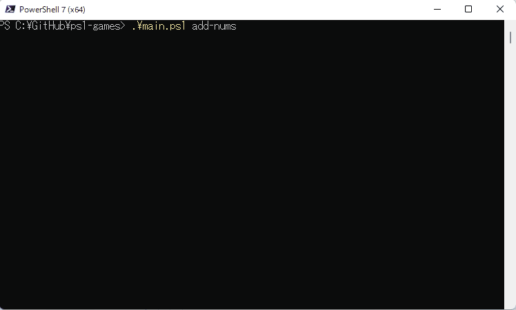
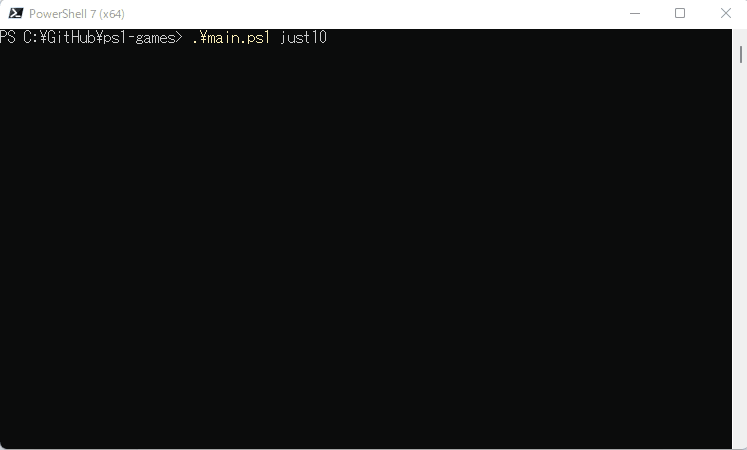
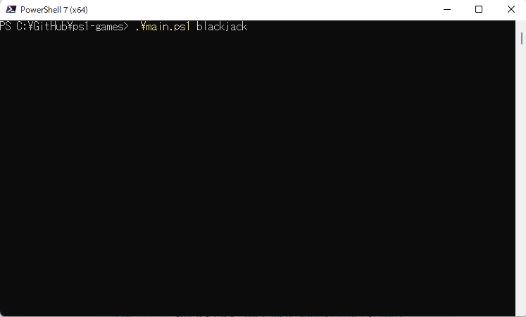

# ps1-games

Powershellで動作する簡単なゲーム。  

  
  
  

## Powershellのバージョン

エスケープシーケンスによる文字の装飾を行っているため、6.0以上が要求される。[^1]

[^1]: https://learn.microsoft.com/ja-jp/powershell/scripting/dev-cross-plat/vscode/using-vscode?view=powershell-7.3&viewFallbackFrom=powershell-7.1#choosing-a-version-of-powershell-to-use-with-the-extension

```shell
# バージョンを確認
$PSVersionTable
```

最新のインストールするためには以下のコマンドを実行。  
インストーラがダウンロードされ、自動で実行される。  

```shell
Invoke-Expression "& { $(Invoke-RestMethod https://aka.ms/install-powershell.ps1) } -UseMSI"
```

<!--
## Gitコミット

```shell
git init
git rebase -i --root --committer-date-is-author-date

git log --pretty=fuller
```
-->
